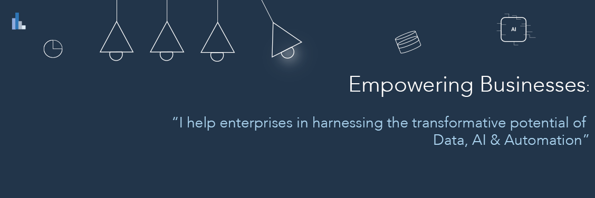

Hi there. I'm Arturo Gonzalez M.
===================================

Software Engineer, Programmer, Data Engineer, DataOps, DevOps, Cloud Engineer, AI/ML Engineer
---------------------------------------------------------------------------------------------

* 🌍  I'm based in ANZ
* ✉️  You can contact me at [arturo@arturosolutions.com.au](mailto:arturo@arturosolutions.com.au)
* 🧠  I am learning how to create bindings for TensorFlow, PyTorch, OpenCV, and YOLO for low-level programming languages.

### Skills

### Socials

 <a href="https://www.github.com/arturogonzalezm" target="_blank" rel="noreferrer"> <picture> <source media="(prefers-color-scheme: dark)" srcset="https://raw.githubusercontent.com/danielcranney/readme-generator/main/public/icons/socials/github-dark.svg" /> <source media="(prefers-color-scheme: light)" srcset="https://raw.githubusercontent.com/danielcranney/readme-generator/main/public/icons/socials/github.svg" />  </picture> </a> <a href="https://www.linkedin.com/in/arturo-gonzalez-m-58165827" target="_blank" rel="noreferrer"> <picture> <source media="(prefers-color-scheme: dark)" srcset="https://raw.githubusercontent.com/danielcranney/readme-generator/main/public/icons/socials/linkedin-dark.svg" /> <source media="(prefers-color-scheme: light)" srcset="https://raw.githubusercontent.com/danielcranney/readme-generator/main/public/icons/socials/linkedin.svg" />  </picture> </a> <a href="http://www.medium.com/@arturogonzalezm" target="_blank" rel="noreferrer"> <picture> <source media="(prefers-color-scheme: dark)" srcset="https://raw.githubusercontent.com/danielcranney/readme-generator/main/public/icons/socials/medium-dark.svg" /> <source media="(prefers-color-scheme: light)" srcset="https://raw.githubusercontent.com/danielcranney/readme-generator/main/public/icons/socials/medium.svg" />  </picture> </a>

### Badges

<b>My GitHub Stats</b>

<table><tr>
<td></td>
<td></td>
</tr></table>

